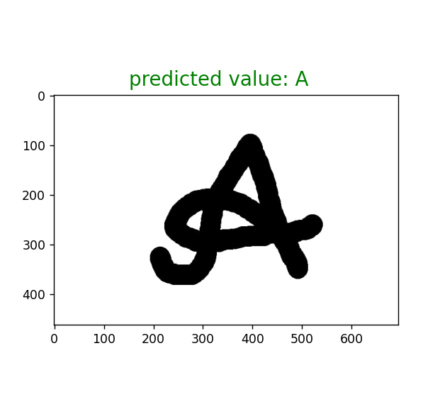

# Handwritten Alphabet Recognition

This project demonstrates a neural network model capable of recognizing handwritten alphabet letters. The model is built using TensorFlow and Keras, leveraging convolutional neural networks (CNNs) for image classification. The dataset used consists of images representing the 26 letters of the English alphabet.

## Prerequisites

Ensure you have the following libraries installed:

- TensorFlow
- NumPy
- Pandas
- OpenCV
- Matplotlib
- Scikit-learn

You can install them using pip:

`pip install -r requirements.txt`

## Downloading the Dataset
1. Visit the Kaggle dataset page for the handwritten alphabets dataset.
   `https://www.kaggle.com/datasets/sachinpatel21/az-handwritten-alphabets-in-csv-format`
2. Click on the "Download" button to download the dataset.
3. After downloading, extract the contents of the zip file.
4. Inside the extracted folder, you'll find a CSV file named A_Z Handwritten Data.csv.
5. Create a directory named data in your project folder.
6. Move the CSV file (A_Z Handwritten Data.csv) into the `data` directory.

## Model Overview
### Image Preprocessing
The sample image is preprocessed by converting it to grayscale and resizing it to 28x28 pixels.

## Dataset Preparation
The dataset is loaded and split into training and testing sets, with the labels being one-hot encoded.

## Model Creation and Training
A Convolutional Neural Network (CNN) model is created, compiled, and trained. If a pre-trained model exists, it is loaded.

## Model Prediction
The trained model is used to predict the letter in the sample image.

## Results
The model is evaluated on the test dataset, achieving a good accuracy. Below is an example of the model predicting a letter from the sample image.

[//]: # (![Certificate Example]&#40;data/result.png&#41;)

## Conclusion
This project showcases the implementation of a CNN for recognizing handwritten alphabet letters. The model achieves good accuracy and can be used for similar image classification tasks. The code can be further optimized and expanded for larger datasets and more complex models.

## Repository Structure
- **data/**: Contains dataset and sample image.
- **Handwritten_Data.csv**: The dataset file with handwritten letters.
- **img_A3.jpg**: The sample image used for testing.
- **model/**: Directory to save the trained model.
- **scripts/**: Contains the code for preprocessing, training, and prediction.

## Future Work
Improve model accuracy by using data augmentation techniques.
Experiment with different architectures and hyperparameters.
Expand the dataset to include more samples per letter.

### Author
LinkedIn Profile: [https://www.linkedin.com/in/ayubxontursunov](https://www.linkedin.com/in/ayubxontursunov)

